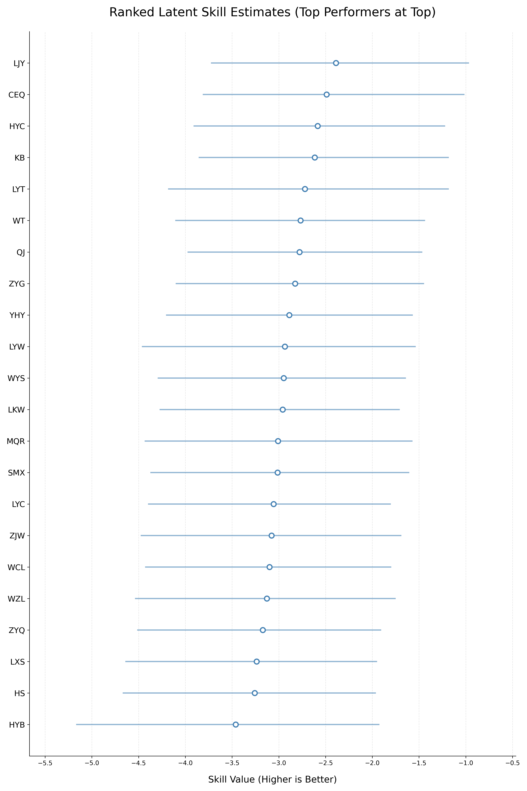

# Bayesian Skill Rating for Strategic Competition: Analyzing "Forest Evolutionism"

This repository contains a Bayesian Hierarchical Model to estimate the latent skills of contestants from the strategic reality show *Forest Evolutionism 2025* (森林进化论2025) from MangoTV. This project demonstrates the application of Bayesian inference to handle sparse, rank-ordered data and quantify competitive uncertainty.

## 📌 Project Overview
Evaluating player performance in strategic games often suffers from two challenges: the relative strength of opponents varies per match, and different game mechanics introduce varying levels of stochasticity. This project implements a **Hierarchical Linear Model** using **PyMC** to separate "individual skill" from "game-specific effects," providing a probabilistic ranking of 22 contestants.

## 🔗 Quick Links
* [**📊 Interactive Analysis Report (HTML)**](https://dddnnnmm.github.io/Forest-Evolution-Player-Skill-Rating-Bayesian/bayesian_skill_model.html)
* [**📄 Technical Whitepaper (PDF)**](https://github.com/dddnnnmm/Forest-Evolution-Player-Skill-Rating-Bayesian/blob/main/Bayesian_Skill_Analysis_Report.pdf)

## 📊 Data Strategy & Stewardship
The dataset was manually curated by transcribing results from 50+ hours of broadcast footage. To ensure statistical robustness, a strict filtering logic was applied:
* **Game Selection:** Only games with at least two matches were included to allow for the estimation of consistent game-specific effects.
* **Format Focus:** The analysis targets individual or duo-based games where individual contributions are most discernable.
* **Handling Sparsity:** The resulting dataset contains 92 player-match records. The Bayesian framework utilizes shrinkage to provide stable estimates for players with fewer appearances.

## 🛠️ Technical Stack
* **Probabilistic Programming:** `PyMC` (NUTS Sampler)
* **Exploratory Data Analysis:** `Pandas`, `Matplotlib`, `Seaborn`
* **Bayesian Diagnostics:** `ArviZ` (R-hat, ESS, HDI)
* **Reporting:** `LaTeX`

## 📈 Key Findings
* **Skill Estimates:** The model successfully identified a clear hierarchy among top-tier players while quantifying uncertainty via **94% Highest Density Intervals (HDI)**.
* **Winning Probability:** By sampling from the posterior, we simulated 10,000 hypothetical matches to calculate the "Win Probability" for each contestant.
* **Shrinkage Effect:** The model effectively prevented overestimation from "lucky" single-match wins by regularizing individual estimates toward the population mean.

## 📂 Repository Structure
* `Bayesian_Skill_Analysis_Report.pdf`: Comprehensive technical report summarizing methodology and findings.
* `/data`: Contains `forest_evo_filtered_data.csv` (Manually curated dataset).
* `/notebook`: Contains `bayesian_skill_model.html` (Exported interactive analysis).
* `/scripts`: `code.py` (Core PyMC model implementation).

## 🚀 Future Improvements
* **Hierarchical Partial Pooling:** Implementing a more complex hierarchical prior to better share information across the player population.
* **Ordinal Modeling:** Transitioning from a Gaussian likelihood to an **Ordered Probit** link function to better reflect the ordinal nature of ranking data.
* **Interaction Effects:** Accounting for player-specific strategic styles (e.g., Aggressive vs. Defensive) and social dynamics.

## 📚 References
* **Data Source:** @MangoTV-Mystery. (2025). *Forest Evolutionism 2025 Full Episodes* [Video playlist]. YouTube. [https://www.youtube.com/playlist?list=PL4nGKjc_PJOSLprB-EZiwa6UB6uBht5x5](https://www.youtube.com/playlist?list=PL4nGKjc_PJOSLprB-EZiwa6UB6uBht5x5)

## 👤 Author
**Emily Fan** *Data Scientist | Current Graduate Student at Georgia Institute of Technology* [LinkedIn](https://www.linkedin.com/in/emily-fan-900053138/) 

---
*Disclaimer: This project is for academic and personal research purposes. Data is derived from publicly available broadcasts on Mango TV.*